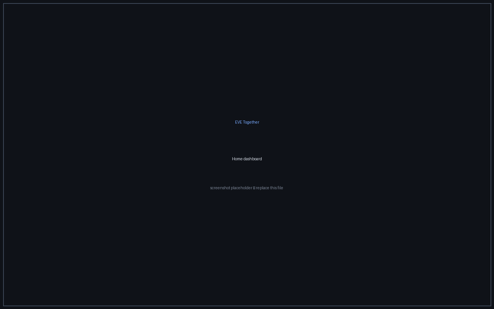
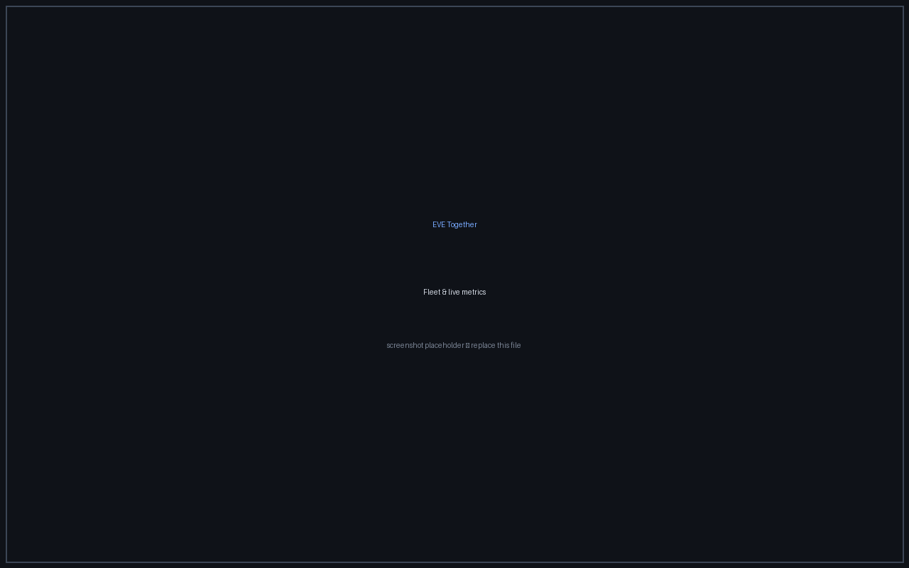

# EVE Together

[](LICENSE)
[](https://dotnet.microsoft.com/)

A **local-first**, **fully autonomous** ops-sec tooling suite for EVE Online — fits, assets,
skills, fleet sync and killboard in one desktop app, with an optional self-hosted server.

- **Client** — desktop app on **Avalonia** (C#/MVVM), local **SQLite**, own ESI connector + gRPC client.
- **Server** — self-hosted (Docker), **configurable** database engine (SQLite / MySQL / SQL Server /
  PostgreSQL), serving Minimal-API + Blazor + gRPC + SignalR on one TLS endpoint.
- **Shared** — data layer + CQRS infra + identity/logging/messaging + **all modules** (vertical slices).

EVE Together is **open source** and **data-minimising** by design: it hosts nothing for you, and you
can see exactly what is stored and sent. It runs live against `login.eveonline.com`.

<p align="center">
  
  
</p>

> **Status: pre-1.0, in active development.** The architecture is in place; some pieces are still
> being built out (see [Status](#status)). Coding conventions live in [`AGENTS.md`](AGENTS.md).

---

## Install

**Desktop client** — download the latest build for your OS from the
[**Releases**](https://github.com/EveTogether/EveTogether/releases) page: Windows (`.zip`), Linux
(`.tar.gz` / `.AppImage`) or macOS (`.zip`, arm64 + x64). The builds are self-contained — no separate
.NET install needed.

**Server** — self-hosted via Docker; see [`docs/server-installation.md`](docs/server-installation.md).

> **Pre-1.0:** expect breaking changes between releases; versions follow [SemVer](https://semver.org/).
> To build from source instead, see [Requirements](#requirements) and [Running](#running).

---

## Requirements

| Tool | Version |
|------|---------|
| .NET SDK | **10.0+** (`.slnx`) |
| `dotnet-ef` | 10.0+ |
| Avalonia templates | `dotnet new install Avalonia.Templates` (only to scaffold the client) |

The client and the server-in-dev run on SQLite → **no external database** needed. Live ESI auth needs
an EVE SSO app (`client_id`/`secret`) — see [Configuration](#configuration).

---

## Architecture

Three core projects — **`EveUtils.Client`** (Avalonia desktop), **`EveUtils.Server`** (self-hosted Docker
host) and **`EveUtils.Shared`** (data layer, CQRS, identity/messaging and all vertical-slice modules) —
plus migration plumbing and test projects. CQRS with its own dispatcher (no MediatR), a server-side
permission gate, a local + gRPC event bus, and two per-character auth modes (local / server-synced).

See **[`docs/architecture.md`](docs/architecture.md)** for the full breakdown: projects, modules, CQRS,
the permission gate, the event bus, auth, and the EF contexts.

---

## Configuration

**Server** — ships with **no EVE credentials baked in**. Each deployment registers its own EVE
application and supplies the Client ID and Secret; the server refuses to start outside Development if
they are missing. Configure it via **environment variables** (primary) or by mounting an
`appsettings.Production.json` (alternative). Key settings:
- `Esi__ClientId` / `Esi__ClientSecret` / `Esi__CallbackUri` — your EVE application (required).
- `Database__Provider` (`Sqlite`|`MySql`|`SqlServer`|`PostgreSql`) + `ConnectionStrings__<Provider>`.
- `Server__AdminSeedPassword` — initial Blazor control-panel admin password (required outside Development).

The server is distributed as a **Docker image** — see [`docs/server-installation.md`](docs/server-installation.md)
for the full guide, including how to register the EVE application.

For local development, put credentials in `EveUtils.Server/appsettings.Development.json` (gitignored).

**Client** — SQLite fixed (default `eve-utils-client.db`); ESI via the bundled public app.

---

## Running

A `Makefile` bundles the shortcuts (runs in **Development** mode); `make` or `make help` shows everything:

```bash
make server                          # server (SQLite dev, Development; HTTPS + Blazor + gRPC)
make client                          # Avalonia desktop
make smoke                           # headless data/CQRS verification (--smoke)
make build                           # build the whole solution
make test                            # all headless test suites (server + client)

make server PROVIDER=PostgreSql      # override the db provider
make server ENVIRONMENT=Production   # override the environment (default Development)
```

Underneath it is just `dotnet run` — directly works too:

```bash
dotnet run --project EveUtils.Server                       # default SQLite dev (HTTPS + Blazor + gRPC)
Database__Provider=PostgreSql dotnet run --project EveUtils.Server
dotnet run --project EveUtils.Client                       # Avalonia desktop
dotnet run --project EveUtils.Client -- --smoke            # headless data/CQRS verification
```

Server admin UI (Blazor): **Dashboard** (permission toggles + shared fits), **Logs**, **AllowedList**.

### Endpoints (server)

| Type | Path | Function |
|------|------|----------|
| `GET` | `/` · `/status` | role + provider + health |
| `GET`/`POST` | `/ships` | Ships — `GetShipsQuery` / `AddShipCommand` (failure = `400` + messages) |
| `GET` | `/sync-logs` | Sync (server-only) |
| `GET` | `/api/server/scopes` | required/optional ESI scopes from the scope registry |
| `GET` | `/auth/eve/callback` | EVE SSO server-redirect callback (Mode B) |
| `GET` | `/stream/dps` · SignalR `/hubs/dps` | live DPS stream |
| gRPC | `Pairing` · `Session` · `EventBusStream` · `Fittings` | pairing/TOFU, session refresh + heartbeat, event-bus bidi stream, fit share/get/delete |

---

## Managing migrations

```bash
make migrate-add NAME=<Name> [SCOPE=all|client|server]   # or: scripts/add-migration.sh <Name> [scope]
make migrate-remove [SCOPE=all|client|server]            # or: scripts/remove-migration.sh [scope]
```

One stack per (context, provider); the scripts pass the right `--context`. `remove` uses `--force` (rolls
back files only) — not for already-deployed migrations.

---

## Adding a feature/module

1. Create `EveUtils.Shared/Modules/<Name>/` with `Entities/` (+ `IEntityTypeConfiguration`), `Dtos/`,
   `Repositories/`, `Queries/`, `Commands/`, optionally `Events/` + `<Name>Permissions.cs`, and `<Name>Module.cs`.
2. `<Name>Module`: `ConfigureModel(ModelBuilder)` + `Add<Name>Module()` (repos +
   `AddModuleHandlers(typeof(<Name>Module))` + optionally `AddModulePermissions(catalog)` /
   `AddModuleEsiScopes(catalog)`).
3. Have the right context apply the config (`base.OnModelCreating` + `…Module.ConfigureModel`).
4. Load the module in the host(s) that need it (`Add<Name>Module()`).
5. Migration: `scripts/add-migration.sh <Name> [scope]`, then `dotnet build`.

See [`AGENTS.md`](AGENTS.md) for the full conventions before you write code.

---

## Status

- ✅ Build green (.NET 10, 0 warnings), 8 projects.
- ✅ Vertical-slice modules (Ships/Settings/Sync/Esi/Fittings/Gamelog/ServerAuth) with internal
  entities/repos/CQRS; data access via `IDbContextFactory<SharedDbContext>`; per-module handler and
  permission registration.
- ✅ **Local + remote event bus** — in-process (`InProcessEventBus`) + gRPC bidi stream (`EventBusStream`),
  auth-gated.
- ✅ **EVE SSO live** — Mode A (local PKCE+confidential) and Mode B (server-redirect + pairing) against
  `login.eveonline.com`; multi-character; per-character encrypted token store + background refresh.
- ✅ **Permission gate server-side** — two-layer (`fit.sync`/`fit.manage`), persistent toggles on the
  Blazor dashboard.
- ✅ **Fittings end-to-end** — ESI import, local + server-shared fits, share/download/delete via gRPC,
  cross-character push.
- ✅ **gRPC + TOFU cert pinning**, auto-reconnect with backoff, server session refresh + expired-session cleanup.
- ✅ **Gamelog/DPS** — live tailing + combat parsing + DPS stream (SignalR).
- ⏳ Server on MySQL/SQL Server/PostgreSQL: stacks ready, runtime test needs a running engine.

---

## Documentation

| Document | What it covers |
|----------|----------------|
| [`docs/architecture.md`](docs/architecture.md) | Full architecture: projects, modules, CQRS, permission gate, event bus, auth, EF contexts |
| [`AGENTS.md`](AGENTS.md) | Coding conventions + module structure — read before contributing code |
| [`docs/server-installation.md`](docs/server-installation.md) | Self-hosting the server (Docker): EVE app registration, configuration, TLS/reverse proxy |
| [`CONTRIBUTING.md`](CONTRIBUTING.md) | How to contribute, the PR bar, and what gets closed |
| [`CODE_OF_CONDUCT.md`](CODE_OF_CONDUCT.md) | Community standards for participation |
| [`SECURITY.md`](SECURITY.md) | How to report a security vulnerability privately |
| [`CHANGELOG.md`](CHANGELOG.md) | Release history |
| [`LICENSE`](LICENSE) | Full GNU AGPL v3.0 text |

---

## Support

- **Questions, ideas or just want to chat?** Join our [Discord](https://discord.gg/tPEP92TYxD).
- **Found a bug or have a feature request?** [Open an issue](https://github.com/EveTogether/EveTogether/issues/new/choose) — the templates show what we need to act on it. A good bug report needs no code and is genuinely useful.
- **Security issue?** Don't open a public issue — follow [`SECURITY.md`](SECURITY.md) to report it privately.

## Contributing

Contributions are welcome, but the bar is high for a small team. **Read [`CONTRIBUTING.md`](CONTRIBUTING.md)
and [`AGENTS.md`](AGENTS.md) before opening a pull request** — PRs are judged against `AGENTS.md`, and
unreviewed or out-of-scope PRs are closed without a line-by-line review. By participating you agree to the
[Code of Conduct](CODE_OF_CONDUCT.md).

## Authors & maintainers

- **RaymondKrah**
- **Jithran**

Both are the maintainers; project direction and what gets merged rest with them (see [Contributing](#contributing)).

## Licence

EVE Together is licensed under the **GNU Affero General Public License v3.0** — see [`LICENSE`](LICENSE).
The network clause means anyone offering a modified server over a network must share the modified source.

EVE Online and all related material are the property of CCP Games:

> Material related to EVE-Online is used with limited permission of CCP Games hf by using official Toolkit.
> No official affiliation or endorsement by CCP Games hf is stated or implied.
