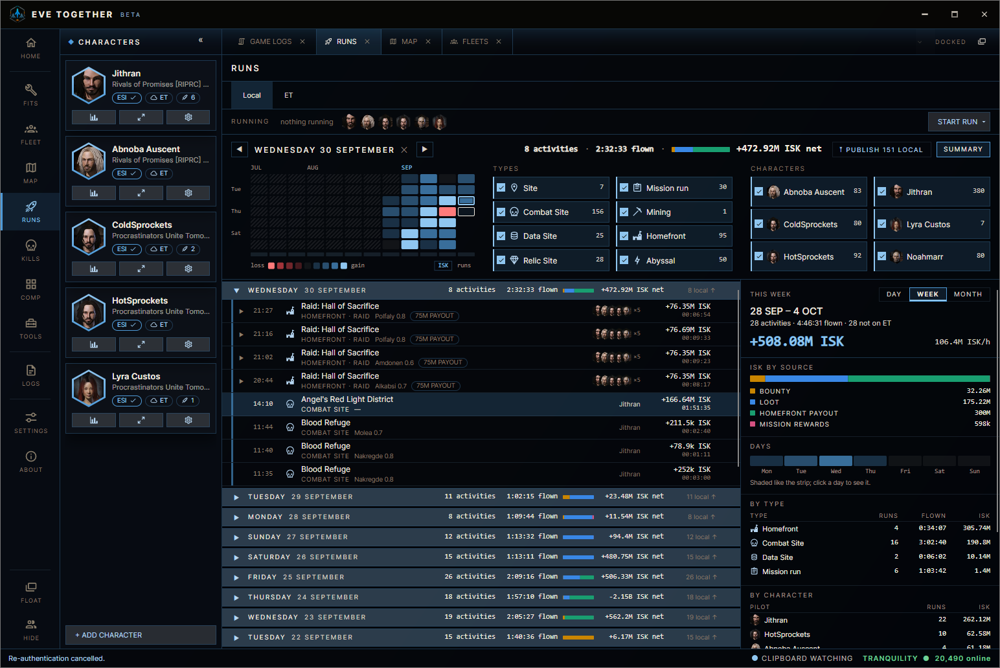
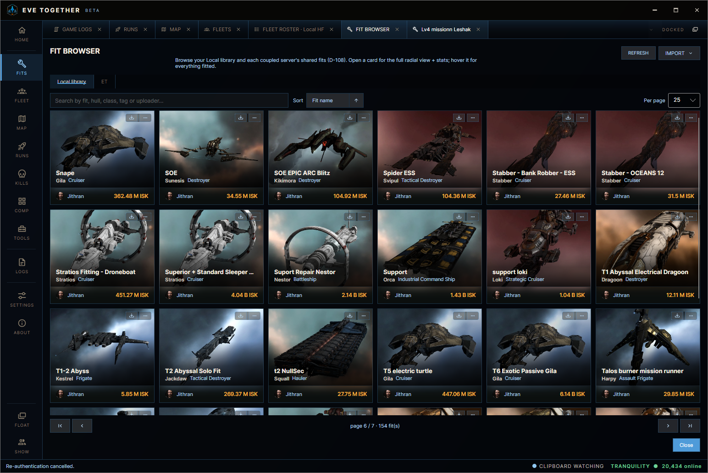
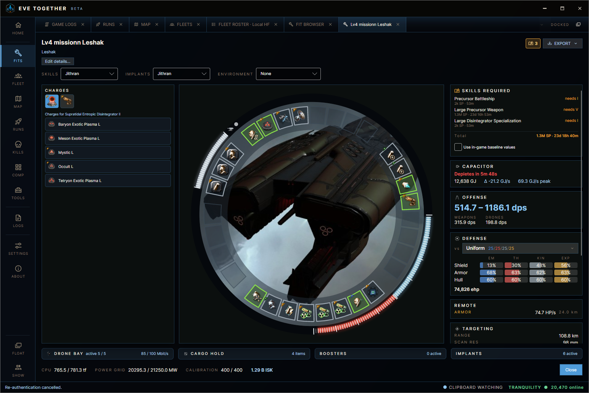
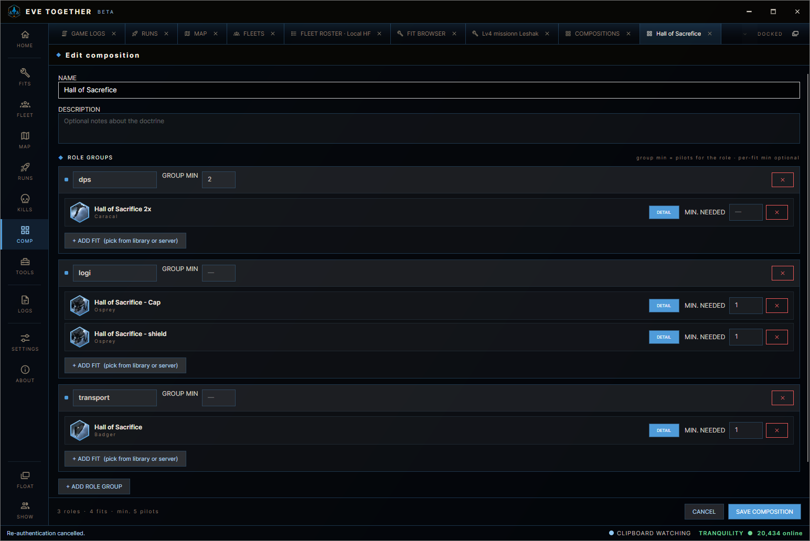
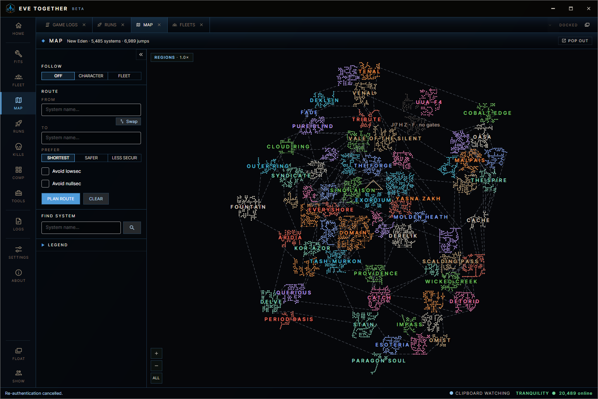
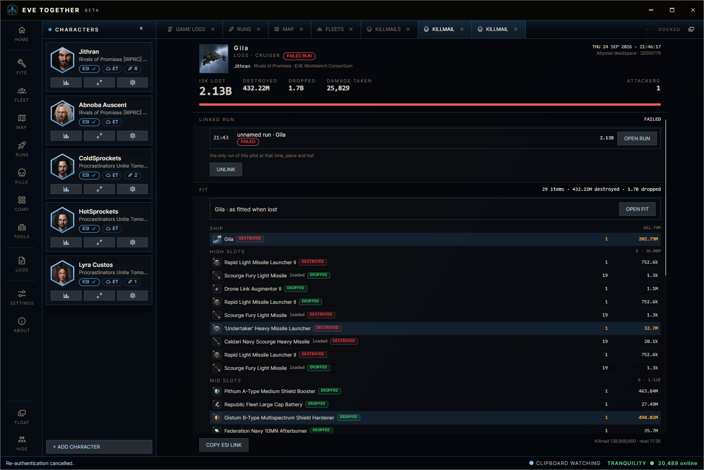
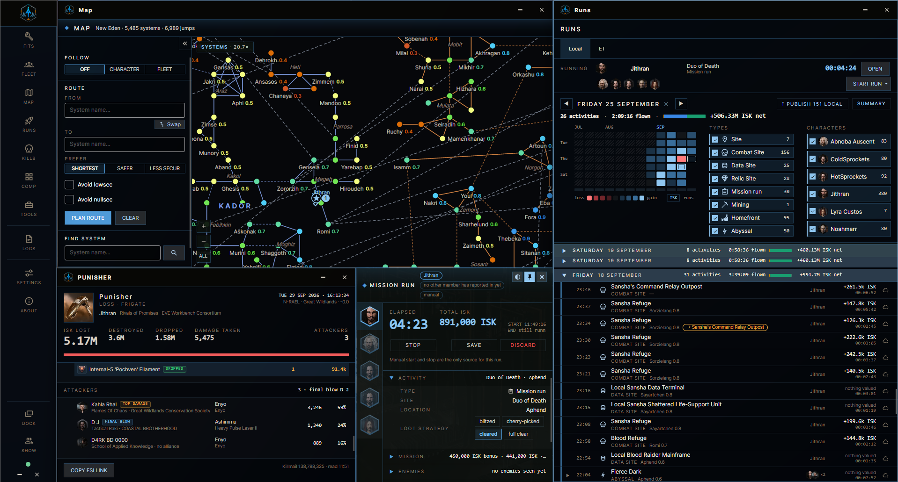

# EVE Together

[](LICENSE)
[](https://dotnet.microsoft.com/)

A **local-first**, **fully autonomous** ops-sec toolkit for EVE Online — fits, fleets, compositions,
runs, killmails and a map of New Eden in one desktop app, with an optional self-hosted server for
flying as a group.

EVE Together is **open source** and **data-minimising** by design: it hosts nothing for you, and you
can see exactly what is stored and sent. Your data lives in a local SQLite database on your own PC.

<p align="center">
  
</p>

> **Beta.** EVE Together is usable day to day, but versions follow [SemVer](https://semver.org/) and
> pre-1.0 releases may contain breaking changes. Coding conventions live in [`AGENTS.md`](AGENTS.md).

---

## What it does

Every entry in the left rail of the app is one module:

| Module | What you get |
|--------|--------------|
| **Home** | The start screen: ISK earned today, this week and this month, your pilots with skill-queue standing, the runs going right now and the latest ones, your fleets, best drops, the 30-day activity chart and a system strip. |
| **Fits** | A browser for your local library and every coupled server's shared fits, as ship cards with price. Import from ESI, an EFT block, DNA or an eveship.fit link; push to ESI or export. The radial fit detail shows capacitor, offence, defence, targeting and drones, recalculated for the skills and implants of a character you pick. |
| **Fleet** | Plan fleets with wings, squads and members, start and stop them, and couple them to your live in-game fleet: structure, invites, moves and kicks. Fleet metrics shows live DPS, mining, bounty and the fleet on a map, and a pop-out overlay keeps the figures on a second screen. |
| **Map** | All of New Eden as a zoomable map with route planning (shortest, safer, less secure; avoid lowsec or nullsec), system search, hover cards, following one of your characters or a whole fleet, and a trail of where a character has been. Routes are worked out on your own PC. The map can pop out into its own window. |
| **Runs** | What you flew and what it paid: Homefront, Abyssal, mission, mining, combat, data and relic sites. A running band shows what is going on now; the list is grouped per day with a calendar, an activity strip, type and character filters and a day / week / month summary of ISK by source. Start a run by hand from Tools, or let the app offer one. |
| **Kills** | Your own kills and losses from ESI, for all characters at once, with totals, a full killmail detail view and the loss linked to the run you lost the ship in. Paste a killmail link to import it immediately. |
| **Comp** | Fleet compositions: role groups with minimum pilots and the fits approved for each, shared through a server or kept local. |
| **Tools** | **EVE Settings Sync** copies EVE's window layout, overview and account settings between characters, with a backup first. **Appraisal** values pasted items at cached market prices. **Start Run** starts a run by hand. |
| **Logs** | **Game logs** (all characters in one list, filtered by character, type and day), **Inbox**, **ESI metrics** and the **Client logs**. |
| **Settings / About** | Gamelog folder, data folder, faction theme (Gallente, Amarr, Caldari, Minmatar), toasts, week start, fit images, clipboard watch, the local API server, keyboard shortcuts and the update channel. |

Characters are added from the character column with EVE SSO; each one picks the ESI scopes it
grants (location, ship type, fleets, fittings, skills and skill queue, implants, killmails) and
features that need a scope you did not grant say so instead of failing silently. A character can be
removed again, which deletes its tokens and cached data from your PC.

Live metrics — DPS, repairs, neuts, mining, bounty and location — are read from your EVE game logs.
English, German, Russian, French, Spanish, Japanese and Chinese clients are supported.

<p align="center">
  
  
</p>
<p align="center">
  
  
</p>
<p align="center">
  
  
</p>

---

## Install

**Desktop client** — download the latest build from the
[**Releases**](https://github.com/EveTogether/EveTogether/releases) page. The builds are Velopack
packages and are self-contained, so there is no separate .NET install:

| OS | Download |
|----|----------|
| Windows | `-Setup.exe` installer, or the `-Portable.zip` |
| Linux | `.AppImage` |
| macOS | `-Setup.pkg` (arm64 and x64) |

Installed builds update themselves: Settings → Updates has a *Check for updates on startup* toggle, a
**Stable / Nightly** channel switch and a *Check now* button. Stable is the default; nightly is an opt-in
rolling build of `main`.

**Where your data lives** — in `%LOCALAPPDATA%\EveTogetherData` on Windows (Settings → Show Data Folder opens
it): settings, sign-ins, fits, runs, caches and backups. The first start of a version that predates the rename
moves the old `EveUtils` folder over by itself.

**Server** — optional and self-hosted via Docker (`ghcr.io/evetogether/eve-together-server`); see
[`docs/server-installation.md`](docs/server-installation.md). You only need it for the together features:
shared fits and compositions, server fleets and fleet-wide live metrics. Solo play needs nothing but the client.

To build from source instead, see [Requirements](#requirements) and [Running](#running).

---

## Requirements

**To use the app:** nothing beyond the installer. Playing with live metrics needs EVE's game logs on the same PC;
the first start downloads EVE's static data (about 100 MB) once.

**To build from source:**

| Tool | Version |
|------|---------|
| .NET SDK | **10.0+** (`.slnx`) |
| `dotnet-ef` | 10.0+ (only for migrations) |

The client and the server-in-dev run on SQLite → **no external database** needed. Live ESI auth against the
server needs an EVE SSO app (`client_id`/`secret`) — see [Configuration](#configuration).

---
## Architecture

Three core projects — **`EveUtils.Client`** (Avalonia desktop), **`EveUtils.Server`** (self-hosted Docker
host) and **`EveUtils.Shared`** (data layer, CQRS, identity/messaging and all vertical-slice modules) —
plus migration plumbing and test projects. CQRS with its own dispatcher (no MediatR), a server-side
permission gate, a local + gRPC event bus, and two per-character auth modes (local / server-synced).

See **[`docs/architecture.md`](docs/architecture.md)** for the full breakdown: projects, modules, CQRS,
the permission gate, the event bus, auth, and the EF contexts.

---

## Configuration

**Server** — ships with **no EVE credentials baked in**. Each deployment registers its own EVE
application and supplies the Client ID and Secret; the server refuses to start outside Development if
they are missing. Configure it via **environment variables** (primary) or by mounting an
`appsettings.Production.json` (alternative). Key settings:
- `Esi__ClientId` / `Esi__ClientSecret` / `Esi__CallbackUri` — your EVE application (required).
- `Database__Provider` (`Sqlite`|`MySql`|`SqlServer`|`PostgreSql`) + `ConnectionStrings__<Provider>`.
- `Server__AdminSeedPassword` — initial Blazor control-panel admin password (required outside Development).

The server is distributed as a **Docker image** — see [`docs/server-installation.md`](docs/server-installation.md)
for the full guide, including how to register the EVE application.

For local development, put credentials in `EveUtils.Server/appsettings.Development.json` (gitignored).

**Client** — local SQLite (`eve-utils-client.db` in the data folder); ESI sign-in via the bundled public app.

---

## Running

A `Makefile` bundles the shortcuts (runs in **Development** mode); `make` or `make help` shows everything:

```bash
make server                          # server (SQLite dev, Development; HTTPS + Blazor + gRPC)
make client                          # Avalonia desktop
make smoke                           # headless data/CQRS verification (--smoke)
make build                           # build the whole solution
make test                            # all headless test suites (server + client)

make server PROVIDER=PostgreSql      # override the db provider
make server ENVIRONMENT=Production   # override the environment (default Development)
```

Underneath it is just `dotnet run` — directly works too:

```bash
dotnet run --project EveUtils.Server                       # default SQLite dev (HTTPS + Blazor + gRPC)
Database__Provider=PostgreSql dotnet run --project EveUtils.Server
dotnet run --project EveUtils.Client                       # Avalonia desktop
dotnet run --project EveUtils.Client -- --smoke            # headless data/CQRS verification
```

Server control panel (Blazor): **Dashboard** (state tiles and what needs attention), **Data** (characters, compositions, shared fits, fleets, runs and sessions), **Allowed list**, **Users** and **Roles**, **API keys**, **Backup** (one AES-256 encrypted archive), **ESI** metrics and **Logs**.

### Endpoints (server)

| Type | Path | Function |
|------|------|----------|
| `GET` | `/` · `/status` | role + provider + health |
| `GET` | `/api/server/scopes` | required/optional ESI scopes from the scope registry |
| `GET` | `/auth/eve/callback` | EVE SSO server-redirect callback (Mode B) |
| `GET` | `/stream/dps` · SignalR `/hubs/dps` | live DPS stream |
| gRPC | `Pairing` · `Session` · `EventBusStream` · `Fittings` | pairing/TOFU, session refresh + heartbeat, event-bus bidi stream, fit share/get/delete |

---

## Managing migrations

```bash
make migrate-add NAME=<Name> [SCOPE=all|client|server]   # or: scripts/add-migration.sh <Name> [scope]
make migrate-remove [SCOPE=all|client|server]            # or: scripts/remove-migration.sh [scope]
```

One stack per (context, provider); the scripts pass the right `--context`. `remove` uses `--force` (rolls
back files only) — not for already-deployed migrations.

---

## Adding a feature/module

1. Create `EveUtils.Shared/Modules/<Name>/` with `Entities/` (+ `IEntityTypeConfiguration`), `Dtos/`,
   `Repositories/`, `Queries/`, `Commands/`, optionally `Events/` + `<Name>Permissions.cs`, and `<Name>Module.cs`.
2. `<Name>Module`: `ConfigureModel(ModelBuilder)` + `Add<Name>Module()` (repos +
   `AddModuleHandlers(typeof(<Name>Module))` + optionally `AddModulePermissions(catalog)` /
   `AddModuleEsiScopes(catalog)`).
3. Have the right context apply the config (`base.OnModelCreating` + `…Module.ConfigureModel`).
4. Load the module in the host(s) that need it (`Add<Name>Module()`).
5. Migration: `scripts/add-migration.sh <Name> [scope]`, then `dotnet build`.

See [`AGENTS.md`](AGENTS.md) for the full conventions before you write code.

---

## Releases

Releases are built by the GitHub Actions release pipeline: publishing a GitHub Release tagged `vX.Y.Z` attaches the
Velopack builds for Windows, Linux and macOS and publishes the server image to
`ghcr.io/evetogether/eve-together-server` (`:latest` and `:X.Y.Z`). The notes of a release come from the matching
section of [`CHANGELOG.md`](CHANGELOG.md). A nightly pre-release of `main` is published separately for those who
opt in. Server stacks other than SQLite (MySQL, SQL Server, PostgreSQL) are built and migrated but still need
wider testing against running engines.

---
## Documentation

| Document | What it covers |
|----------|----------------|
| [`docs/architecture.md`](docs/architecture.md) | Full architecture: projects, modules, CQRS, permission gate, event bus, auth, EF contexts |
| [`docs/clipboard.md`](docs/clipboard.md) | The clipboard watch: its privacy guarantees, why polling is excluded, and the measured EVE clipboard formats |
| [`AGENTS.md`](AGENTS.md) | Coding conventions + module structure — read before contributing code |
| [`docs/server-installation.md`](docs/server-installation.md) | Self-hosting the server (Docker): EVE app registration, configuration, TLS/reverse proxy |
| [`CONTRIBUTING.md`](CONTRIBUTING.md) | How to contribute, the PR bar, and what gets closed |
| [`CODE_OF_CONDUCT.md`](CODE_OF_CONDUCT.md) | Community standards for participation |
| [`SECURITY.md`](SECURITY.md) | How to report a security vulnerability privately |
| [`CHANGELOG.md`](CHANGELOG.md) | Release history |
| [`LICENSE`](LICENSE) | Full GNU AGPL v3.0 text |

---

## Support

- **Questions, ideas or just want to chat?** Join our [Discord](https://discord.gg/tPEP92TYxD).
- **Found a bug or have a feature request?** [Open an issue](https://github.com/EveTogether/EveTogether/issues/new/choose) — the templates show what we need to act on it. A good bug report needs no code and is genuinely useful.
- **Security issue?** Don't open a public issue — follow [`SECURITY.md`](SECURITY.md) to report it privately.

## Contributing

Contributions are welcome, but the bar is high for a small team. **Read [`CONTRIBUTING.md`](CONTRIBUTING.md)
and [`AGENTS.md`](AGENTS.md) before opening a pull request** — PRs are judged against `AGENTS.md`, and
unreviewed or out-of-scope PRs are closed without a line-by-line review. By participating you agree to the
[Code of Conduct](CODE_OF_CONDUCT.md).

## Authors & maintainers

- **RaymondKrah**
- **Jithran**

Both are the maintainers; project direction and what gets merged rest with them (see [Contributing](#contributing)).

## Licence

EVE Together is licensed under the **GNU Affero General Public License v3.0** — see [`LICENSE`](LICENSE).
The network clause means anyone offering a modified server over a network must share the modified source.

EVE Online and all related material are the property of CCP Games:

> Material related to EVE-Online is used with limited permission of CCP Games hf by using official Toolkit.
> No official affiliation or endorsement by CCP Games hf is stated or implied.
